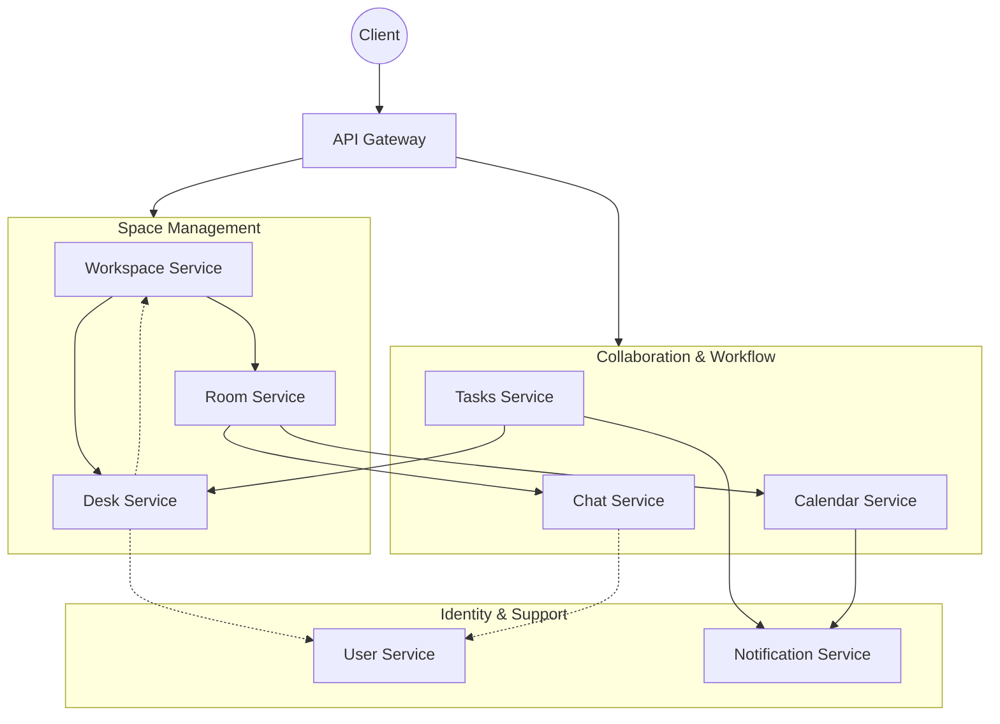

# Virtual Office Backend

A microservices-based backend system for a Virtual Office application.

## Services & Ports

| Service                  | Port   | What it does                                                                   |
| :----------------------- | :----- | :----------------------------------------------------------------------------- |
| **Gateway API**          | `8080` | The single entry point for all clients. Routes requests to the correct service |
| **User Service**         | `8081` | Handles authentication, user accounts, and identity                            |
| **Notification Service** | `8082` | Sends alerts, emails, and push notifications based on system events            |
| **Calendar Service**     | `8083` | Manages meetings, scheduling, and time-based events                            |
| **Chat Service**         | `8084` | Handles all messaging (direct messages, workspace chats, room chats)           |
| **Tasks Service**        | `8085` | Manages tasks, assignments, and progress tracking                              |
| **Room Service**         | `8086` | Manages virtual rooms (voice channels, meetings, future video)                 |
| **Workspace Service**    | `8087` | Manages workspaces, desks, and overall structure                               |
| **Desk Service**         | `8088` | Manages desks (represents a user inside a workspace)                           |
| **Shared Library**       | N/A    | Shared DTOs, utilities, and common logic                                       |

## Service Communication




## Mental Model

* **User** = you
* **Workspace** = a company / team
* **Desk** = your seat in that workspace
* **Room** = voice / meeting space
* **Chat** = messaging layer


## 🛠️ Build & Run

### Prerequisites
- Java 21
- Maven

### Build All Services
```bash
./mvnw clean install
```
